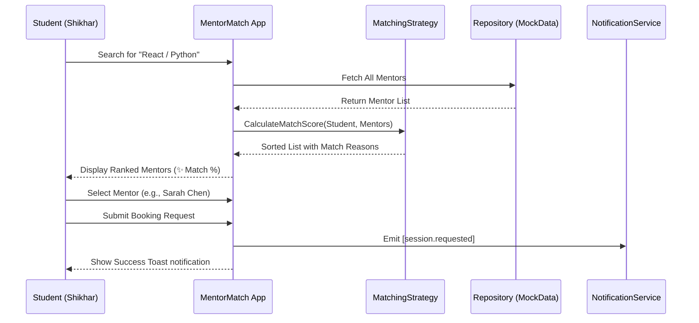
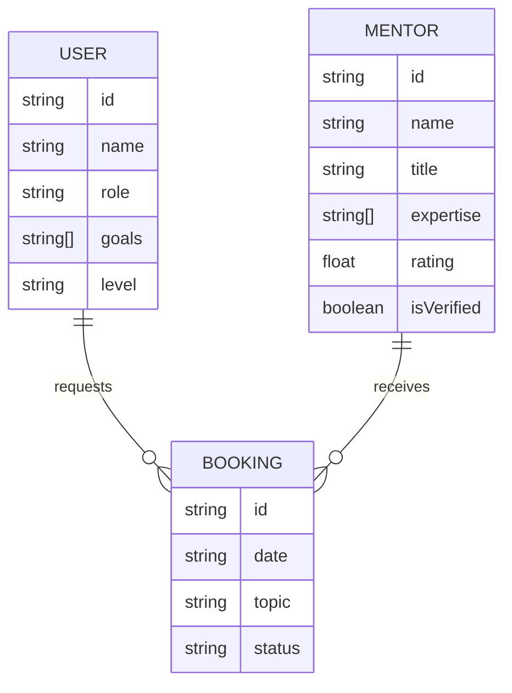

# MentorMatch: Project Blueprint & Architecture Guide

MentorMatch is a premium mentorship marketplace designed to connect students with industry experts through a high-performance, SOLID-based matching system. This document serves as the "source of truth" for explaining the platform's logic and architecture.

## 1. System Vision
The platform moves beyond simple directory listings. It uses **Intelligent Matching Strategies** to ensure students find the right mentor for their specific skill level and learning goals.

### The Problem
Traditional mentorship platforms are cluttered, lack verification, and don't provide context-aware matching.

### The Solution
A glassmorphic, performant web application that prioritizes **Match Quality** over quantity.

---

## 2. Core System Flow
This diagram illustrates the lifecycle of a student finding and booking a mentor.

---

## 3. Data Model (Entity Relationships)
Our data layer is built to be extensible, separating high-level entities from their storage implementation.

---

## 4. Architectural Excellence (SOLID & Patterns)

MentorMatch is engineered using clean code principles to ensure it can scale from a simple JS app to a full-stack production platform.

### Design Patterns in Use

| Pattern | Role in MentorMatch | Benefit |
| :--- | :--- | :--- |
| **Strategy** | `calculateMatchScore` performs skill-based matching. | Can easily swap "Skill-based" for "Project-based" matching without changing UI. |
| **Repository** | `mockData.js` simulates our data source. | Decouples the UI from the database; switching to Supabase/Postgres is seamless. |
| **Observer** | Simulated event emission `[Event: session.requested]`. | Allows decoupled systems (Email, SMS, Logging) to react to user actions. |
| **Factory** | (Planned) Generating Mentor/User objects. | Ensures consistent data structures throughout the app. |

### SOLID Application
- **Single Responsibility**: `app.js` handles UI, `mockData.js` handles data, `calculateMatchScore` handles logic.
- **Open/Closed**: The matching logic is open for extension (add new scoring rules) but closed for modification of core flow.
- **Interface Segregation**: Components only receive the data they need to render (e.g., the booking modal only knows about the `selectedMentor`).

---

## 5. Implementation Roadmap

### Phase 1: Interactive Frontend (Current)
- [x] Glassmorphic UI with CSS Variables
- [x] Intelligent Match Scoring Logic
- [x] Dynamic Search & Filter system
- [x] Booking Modal & Toast Notifications

### Phase 2: Full Stack Integration (Next)
- [ ] **Supabase Integration**: Move from MockData to real-time Auth & Database.
- [ ] **Real Notifications**: Connect the Observer pattern to an email service (SendGrid/Resend).
- [ ] **Payments**: Integrate Stripe for session booking fees.
- [ ] **Mentor Dashboard**: Specialized view for mentors to manage their requests.

---

> [!TIP]
> **To explain this to others:** Start with the **Vision** (solving the bad matching problem), show the **Flow** (how simple it is for a user), and end with the **Architecture** (why it's built to last and scale).
